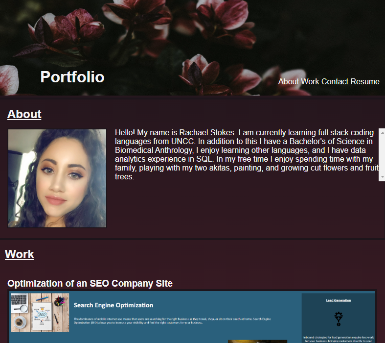
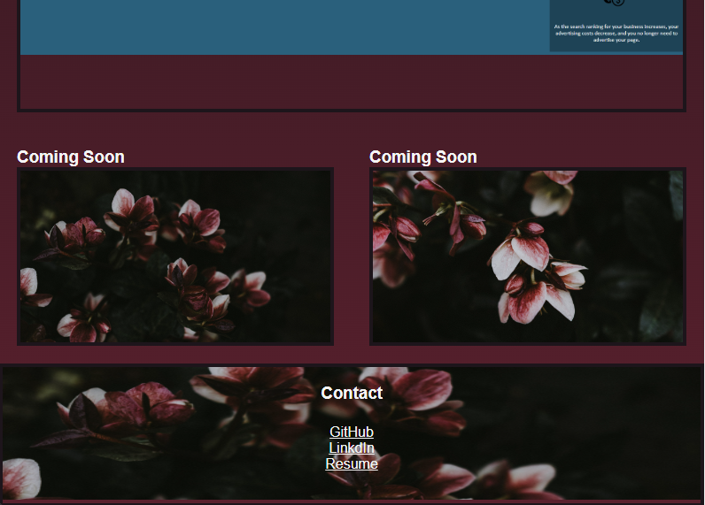

# rachael.stokes.portfolio
## A professional portfolio where I can display my projects for potential employers

I created a professional portfolio with my own code, in order to test my skills.  I have displayed scrolling for text items, changing background color for screen re-sizing, and using photos as links. In the future I would like to add other projects to this portfolio and refine it with new knowledge so I can show it to potential employers.

## Screenshots

## URL 

[liveURL](https://rachaelkstokes.github.io/Rachael.Stokes.Portfolio/) 
